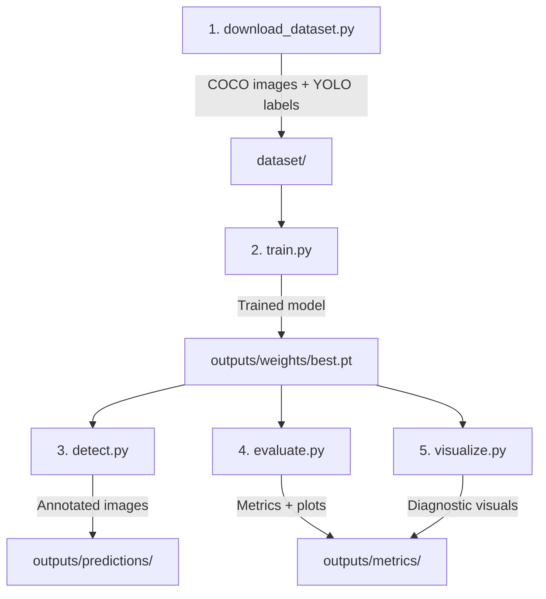

# 🏗️ ARCHITECTURE — Detailed Project Documentation

> A deep dive into every file, module, function, and design decision in this project.

---

## Table of Contents

- [Project Overview](#project-overview)
- [Workflow Pipeline](#workflow-pipeline)
- [File Structure](#file-structure)
- [Component Breakdown](#component-breakdown)
  - [Configuration](#1-configuration)
  - [Dataset Pipeline](#2-dataset-pipeline)
  - [Training Pipeline](#3-training-pipeline)
  - [Inference Engine](#4-inference-engine)
  - [Evaluation Suite](#5-evaluation-suite)
  - [Visualization Suite](#6-visualization-suite)
- [Output Artifacts](#output-artifacts)
- [Dataset Fallback](#dataset-fallback)
- [Known Issues & Fixes](#known-issues--fixes)

---

## Project Overview

This is a **2-class object detection** system that identifies **pedestrians** and **cars** in images using YOLOv8. Unlike typical YOLO demos that stop at training, this project implements a complete diagnostic pipeline:

```
Dataset → Training → Inference → Evaluation → Visualization → Report
```

Every stage is modular — each script can run independently, and outputs are saved to well-defined directories.

---

## Workflow Pipeline



### Step-by-Step Execution

| Order | Command | Input | Output |
|-------|---------|-------|--------|
| 1 | `python scripts/download_dataset.py` | COCO 2017 API | `dataset/images/` + `dataset/labels/` |
| 2 | `python src/train.py` | `dataset/`, `config/*.yaml` | `outputs/weights/best.pt` |
| 3 | `python src/detect.py` | `outputs/weights/best.pt` + test images | `outputs/predictions/*.jpg` |
| 4 | `python src/evaluate.py` | `outputs/weights/best.pt` + test labels | `outputs/metrics/results.json`, plots |
| 5 | `python src/visualize.py` | `outputs/weights/best.pt` + test images | Failure grid, comparison, histogram |

---

## File Structure

```
yolo-pedestrian-car-detection/
│
├── 📄 README.md                  # Project overview, quick start, results
├── 📄 ARCHITECTURE.md            # This file — detailed technical docs
├── 📄 requirements.txt           # Python dependencies
├── 📄 .gitignore                 # Excludes weights, dataset, caches
│
├── 📁 config/                    # Configuration files
│   ├── dataset.yaml              # YOLO dataset paths & class names
│   └── model_config.yaml         # Training hyperparameters
│
├── 📁 scripts/                   # Data preparation scripts
│   └── download_dataset.py       # COCO → YOLO dataset builder
│
├── 📁 src/                       # Core pipeline code
│   ├── train.py                  # Model training
│   ├── detect.py                 # Inference + heatmap overlay
│   ├── evaluate.py               # Metrics computation + plots
│   └── visualize.py              # Failure analysis + comparisons
│
├── 📁 dataset/                   # Generated dataset (gitignored)
│   ├── images/
│   │   ├── train/                # 70 training images
│   │   ├── val/                  # 15 validation images
│   │   └── test/                 # 15 test images
│   └── labels/
│       ├── train/                # YOLO label files (.txt)
│       ├── val/
│       └── test/
│
├── 📁 outputs/                   # All pipeline outputs
│   ├── weights/
│   │   └── best.pt              # Trained model weights (gitignored)
│   ├── predictions/             # Annotated test images with heatmaps
│   └── metrics/
│       ├── results.json         # Precision, recall, mAP per class
│       ├── results.csv          # Training history (loss per epoch)
│       ├── pr_curve.png         # Precision-Recall curve
│       ├── confusion_matrix.png # Confusion matrix
│       ├── failure_cases.png    # Low-confidence prediction grid
│       ├── comparison_grid.png  # Original vs predicted side-by-side
│       └── confidence_histogram.png  # Confidence distribution by class
│
├── 📁 report/                   # Project documentation
│   └── report.md               # Full project report with embedded images
│
└── 📁 runs/                     # Ultralytics training artifacts (gitignored)
```

---

## Component Breakdown

### 1. Configuration

#### `config/dataset.yaml`

Defines the YOLO dataset layout for Ultralytics:

```yaml
path: ./dataset          # Root directory
train: images/train      # Training images
val: images/val          # Validation images
test: images/test        # Test images
nc: 2                    # Number of classes
names: ['pedestrian', 'car']
```

**Key design decision:** Paths are relative to the project root, not the YAML file location. This ensures the project works from any working directory within the repo.

#### `config/model_config.yaml`

Training hyperparameters:

```yaml
model: yolov8n           # YOLOv8 nano variant
epochs: 50               # Training epochs
batch: 16                # Batch size
img_size: 640            # Input image resolution
lr: 0.001                # Initial learning rate
save_dir: outputs/weights
metrics_dir: outputs/metrics
```

**Why these values?**
- `yolov8n` — fastest variant, good for prototyping on small datasets
- `epochs: 50` — sufficient for 70 images; more epochs risk overfitting
- `batch: 16` — fits comfortably in 4GB VRAM
- `img_size: 640` — YOLO default; balances detail vs. speed

---

### 2. Dataset Pipeline

#### `scripts/download_dataset.py`

**Purpose:** Download COCO 2017 validation images and convert them to YOLO format.

| Function | Description |
|----------|-------------|
| `coco_to_yolo_bbox(bbox)` | Converts COCO `[x, y, w, h]` (relative) → YOLO `[cx, cy, w, h]` (relative) |
| `ensure_dirs()` | Creates the `dataset/images/{train,val,test}` and `dataset/labels/{train,val,test}` directory tree |
| `download_samples(label, max_samples, dataset_name)` | Uses FiftyOne to download COCO images containing a specific class |
| `export_sample(sample, split, idx, seen_files)` | Copies image, validates it, writes YOLO label file |
| `main()` | Orchestrates download → merge → split → export |

**Conversion formula:**
```
COCO: [x_topleft, y_topleft, width, height]  (relative)
YOLO: [center_x, center_y, width, height]    (relative)

center_x = x_topleft + width / 2
center_y = y_topleft + height / 2
```

**Data split:** 70% train / 15% val / 15% test with `random.seed(42)` for reproducibility.

**YOLO label format** (each `.txt` file):
```
<class_id> <center_x> <center_y> <width> <height>
0 0.453125 0.612500 0.142188 0.385000
1 0.721875 0.415625 0.203125 0.268750
```

---

### 3. Training Pipeline

#### `src/train.py`

**Purpose:** Load YOLOv8n, train on the custom dataset, and copy best weights + metrics to output directories.

| Function | Description |
|----------|-------------|
| `main()` | Loads config → initializes YOLO model → trains → copies outputs |

**Flow:**
1. Reads `config/model_config.yaml` for hyperparameters
2. Initializes `YOLO("yolov8n")` (auto-downloads pretrained weights)
3. Calls `model.train()` with the config values
4. After training, searches for best weights and copies to `outputs/weights/best.pt`
5. Copies `results.csv` (training history) to `outputs/metrics/`

**Key implementation detail:** Ultralytics doesn't always place output in the expected directory. The glob search uses a recursive fallback:
```python
run_dirs = sorted(glob.glob("runs/train/exp*"))
if not run_dirs:
    run_dirs = sorted(glob.glob("runs/**/train/exp*", recursive=True))
```

---

### 4. Inference Engine

#### `src/detect.py`

**Purpose:** Run the trained model on test images and save annotated images with confidence heatmap overlays.

| Function | Description |
|----------|-------------|
| `overlay_heatmap(image, detections)` | Creates a JET-colormap heatmap overlay based on detection confidence |
| `main()` | Loads model → iterates test images → draws boxes → applies heatmap → saves |

**Heatmap algorithm:**
1. Create a zero-filled float32 array matching image dimensions
2. For each detection, fill the bounding box region with the maximum confidence value
3. Normalize to 0-255 and apply `cv2.COLORMAP_JET`
4. Blend with original image using `cv2.addWeighted(original, 0.7, heatmap, 0.3, 0)`

**Why heatmaps?** Standard bounding boxes show WHAT was detected, but heatmaps show WHERE the model is confident. This is critical for understanding model behavior — intense red regions indicate high certainty, while blue/green areas indicate uncertainty.

**Output format:** Each test image is saved as a JPEG with:
- Green bounding boxes with class labels + confidence scores
- Semi-transparent JET heatmap overlay

---

### 5. Evaluation Suite

#### `src/evaluate.py`

**Purpose:** Compute quantitative metrics and generate evaluation plots.

| Function | Description |
|----------|-------------|
| `main()` | Runs validation → extracts metrics → saves JSON → generates plots |
| `generate_pr_curve(box, save_path)` | Plots precision vs recall curves per class |
| `generate_confusion_matrix(results, save_path)` | Visualizes true vs predicted class distribution |

**Metrics computed:**

| Metric | Description |
|--------|-------------|
| **Precision** | TP / (TP + FP) — how many detections are correct |
| **Recall** | TP / (TP + FN) — how many ground truth objects are detected |
| **mAP@0.5** | Mean Average Precision at IoU threshold 0.5 |
| **mAP@0.5:0.95** | Mean AP averaged across IoU thresholds 0.5 to 0.95 (step 0.05) |

**Output file — `results.json`:**
```json
{
  "precision": 0.5145,
  "recall": 0.3286,
  "mAP50": 0.3615,
  "mAP50-95": 0.2267,
  "per_class": {
    "pedestrian": {"precision": 0.4617, "recall": 0.4429, "mAP50": 0.4095},
    "car": {"precision": 0.5673, "recall": 0.2143, "mAP50": 0.3136}
  }
}
```

**PR Curve implementation:** Uses Ultralytics' internal `box.px` (recall values) and `box.py` (precision values per class) to plot smooth curves. Falls back to single-point plotting if full curve data isn't available.

**Confusion Matrix implementation:** Extracts the confusion matrix from `results.confusion_matrix.matrix`, displays with color-coded cells and numeric annotations. Falls back to an approximate matrix from per-class precision/recall if full data isn't available.

---

### 6. Visualization Suite

#### `src/visualize.py`

**Purpose:** Generate three unique diagnostic visualizations.

| Function | Description |
|----------|-------------|
| `load_test_images()` | Finds all test images matching common extensions |
| `run_predictions(model, image_paths)` | Runs model on all images, returns (path, image, results) tuples |
| `generate_failure_cases(all_results, save_path)` | Finds conf < 0.4 predictions, shows in red-bordered grid |
| `generate_comparison_grid(all_results, save_path)` | 3×2 grid of original vs predicted |
| `generate_confidence_histogram(all_results, save_path)` | Bar chart of confidence distribution by class |
| `main()` | Orchestrates all three visualizations |

#### Visualization 1: Failure Case Grid

**Algorithm:**
1. Scan ALL predictions across ALL test images
2. Filter for confidence < 0.4 (configurable via `CONF_THRESHOLD`)
3. Crop each low-confidence detection with 15px padding
4. If no low-conf detections exist, use images with zero detections (false negatives)
5. Arrange in grid with red borders and failure reason labels
6. Save to `failure_cases.png`

**Why this matters:** Most evaluation scripts just report numbers. This automatically finds the model's worst predictions and shows you WHY they failed. Invaluable for debugging and improving the model.

#### Visualization 2: Side-by-Side Comparison

**Algorithm:**
1. Select up to 3 test images (first 3 in the test set)
2. For each, show original image (left) and annotated image (right) in a 3×2 grid
3. Annotated images have colored bounding boxes (green=pedestrian, orange=car) with labels
4. Save to `comparison_grid.png`

#### Visualization 3: Confidence Histogram

**Algorithm:**
1. Collect all confidence scores across all test predictions
2. Group by class (pedestrian vs car)
3. Create side-by-side bars with 20 bins from 0.0 to 1.0
4. Color-code: blue=pedestrian, red/orange=car
5. Save to `confidence_histogram.png`

**What it reveals:** If all confidences cluster around 0.5, the model is uncertain. If they're bimodal (peaks near 0 and 1), the model has strong opinions. This helps tune the confidence threshold for deployment.

---

## Output Artifacts

| File | Type | Description |
|------|------|-------------|
| `outputs/weights/best.pt` | Binary | Trained YOLOv8n model (6.0 MB) |
| `outputs/predictions/*.jpg` | Images | 15 annotated test images with heatmaps |
| `outputs/metrics/results.json` | JSON | All metrics in machine-readable format |
| `outputs/metrics/results.csv` | CSV | Per-epoch training loss history |
| `outputs/metrics/pr_curve.png` | Plot | Precision-Recall curve by class |
| `outputs/metrics/confusion_matrix.png` | Plot | True vs predicted confusion matrix |
| `outputs/metrics/failure_cases.png` | Plot | Grid of low-confidence/failed predictions |
| `outputs/metrics/comparison_grid.png` | Plot | Original vs predicted side-by-side |
| `outputs/metrics/confidence_histogram.png` | Plot | Confidence score distribution |
| `report/report.md` | Markdown | Full project report with all sections |

---

## Dataset Fallback

The primary dataset script (`scripts/download_dataset.py`) uses **FiftyOne** to download COCO images. FiftyOne requires **MongoDB** to manage datasets. If MongoDB is unavailable:

### Manual Fallback Approach

1. FiftyOne still downloads the raw COCO images to `~/fiftyone/coco-2017/validation/data/`
2. Labels are saved to `~/fiftyone/coco-2017/validation/labels.json`
3. A fallback script parses `labels.json` directly without MongoDB
4. Filters for `category_id=1` (person) and `category_id=3` (car)
5. Converts COCO absolute bounding boxes to YOLO relative format
6. Splits and exports to `dataset/` directory structure

This approach was used in this project's actual execution.

---

## Known Issues & Fixes

### Bug 1: `lr` vs `lr0`
- **File:** `src/train.py`, line 30
- **Problem:** Ultralytics expects `lr0` (initial learning rate), not `lr`
- **Error:** `SyntaxError: 'lr' is not a valid YOLO argument`
- **Fix:** Changed `lr=cfg.get("lr", 0.001)` → `lr0=cfg.get("lr", 0.001)`

### Bug 2: Glob Path Mismatch
- **File:** `src/train.py`, line 38
- **Problem:** Script searches `runs/train/exp*` but Ultralytics outputs to `runs/detect/runs/train/exp`
- **Fix:** Added recursive fallback: `glob.glob("runs/**/train/exp*", recursive=True)`

### Bug 3: FiftyOne MongoDB Dependency
- **File:** `scripts/download_dataset.py`
- **Problem:** FiftyOne requires MongoDB which may not be installed
- **Fix:** Implemented a fallback script that reads raw COCO JSON without MongoDB

---

<p align="center">
  <b>📖 For results and analysis, see the <a href="report/report.md">Full Project Report</a></b>
</p>
