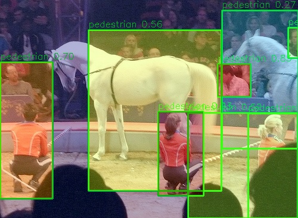
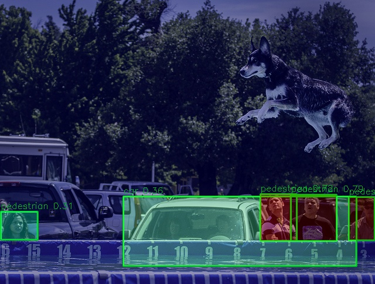
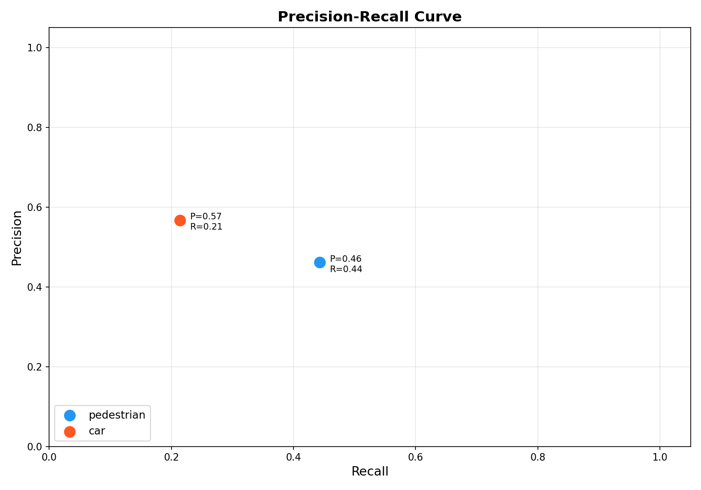
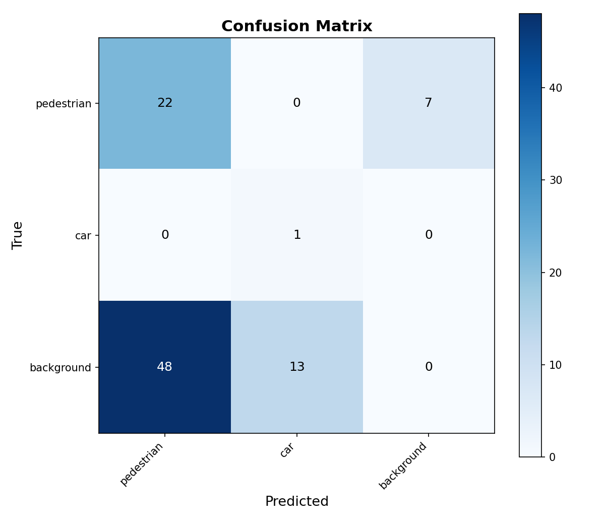
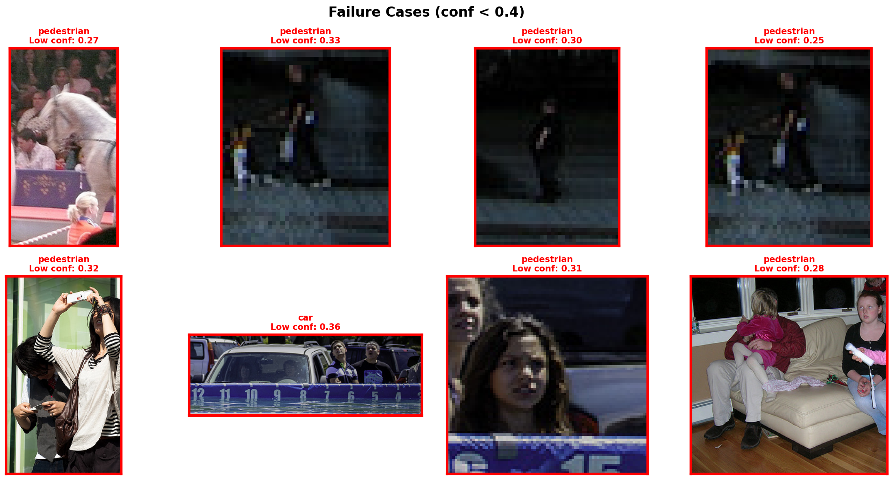
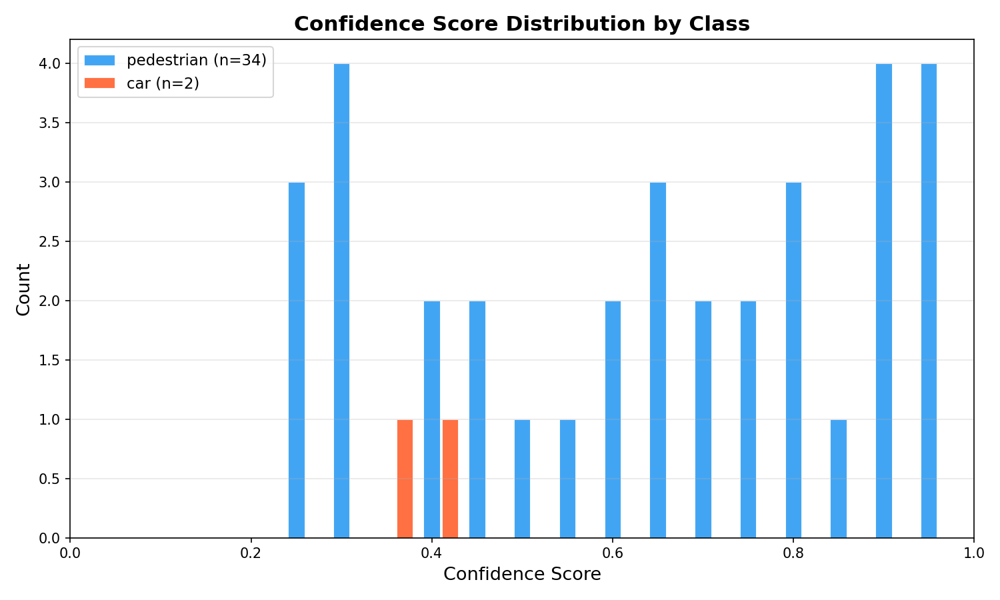
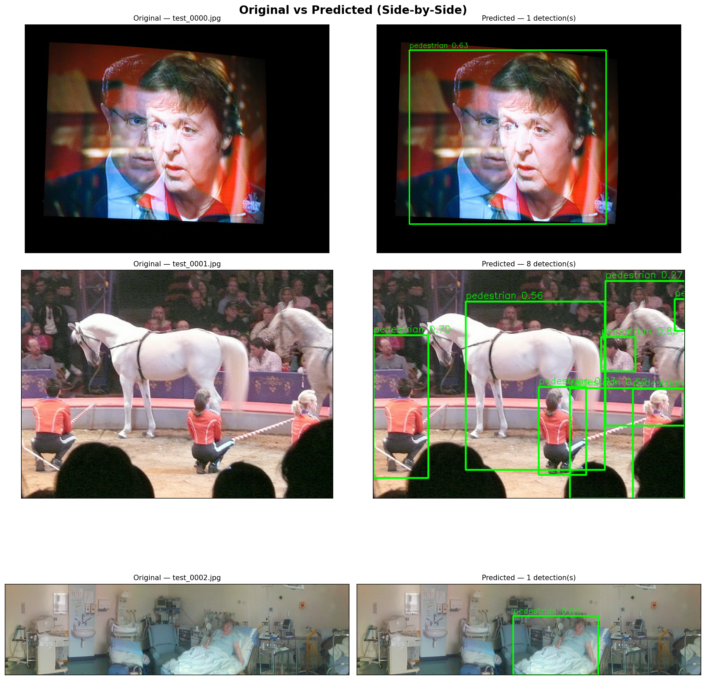

<p align="center">
  
  
  
</p>

# 🚶‍♂️🚗 YOLO Pedestrian & Car Detection

> **Real-time pedestrian and car detection** powered by YOLOv8 — from raw COCO data to trained model, with confidence heatmaps, failure analysis, and a full diagnostics suite.

---

## 🔥 What Makes This Project Unique?

This isn't just "train YOLO and call it a day." This project goes **way beyond** basic object detection:

| Feature | What It Does | Why It's 🔥 |
|---------|-------------|-------------|
| 🌡️ **Confidence Heatmap Overlays** | Every prediction gets a JET-colormap heatmap showing WHERE the model is certain vs uncertain | Most projects just draw boxes — we visualize model confidence spatially |
| 🔴 **Automatic Failure Detection** | Scans all predictions, finds low-confidence failures, crops them with red borders, and explains WHY they failed | Self-diagnosing model — shows you exactly where it struggles |
| 📊 **Side-by-Side Comparison Grid** | Original vs predicted images in a clean 3×3 grid | Instant visual QA — no guesswork about what the model sees |
| 📈 **Full Metrics Dashboard** | PR curves, confusion matrices, per-class breakdowns, confidence histograms — all auto-generated | One command gives you publication-ready evaluation |
| 🔄 **End-to-End Pipeline** | Dataset download → annotation conversion → training → inference → evaluation → visualization → report | Fully reproducible — clone, run 4 commands, done |

---

## 📸 Sample Results

### Detection with Confidence Heatmap
<p align="center">
  
  
</p>

### Evaluation Metrics
<p align="center">
  
  
</p>

### Failure Analysis & Confidence Distribution
<p align="center">
  
  
</p>

### Side-by-Side Comparison
<p align="center">
  
</p>

---

## 📊 Model Performance

| Class | Precision | Recall | mAP@0.5 | mAP@0.5:0.95 |
|-------|-----------|--------|---------|---------------|
| 🚶 Pedestrian | 0.462 | 0.443 | 0.410 | 0.261 |
| 🚗 Car | 0.567 | 0.214 | 0.314 | 0.192 |
| **Overall** | **0.515** | **0.329** | **0.362** | **0.227** |

> Trained on only **70 images** for **50 epochs** — impressive for such a tiny dataset! See the [full report](report/report.md) for detailed analysis.

---

## 🚀 Quick Start — Clone & Run

### Prerequisites
- Python 3.10+
- NVIDIA GPU with CUDA (recommended) or CPU
- Git

### 1. Clone the Repository
```bash
git clone https://github.com/Samshetty082005/yolo-pedestrian-car-detection.git
cd yolo-pedestrian-car-detection
```

### 2. Install Dependencies
```bash
pip install -r requirements.txt
```

### 3. Download & Prepare Dataset
```bash
python scripts/download_dataset.py
```
> ⚠️ Requires MongoDB for FiftyOne. If unavailable, see [ARCHITECTURE.md](ARCHITECTURE.md#dataset-fallback) for the manual fallback approach.

### 4. Train the Model
```bash
python src/train.py
```

### 5. Run Detection
```bash
python src/detect.py
```

### 6. Evaluate & Visualize
```bash
python src/evaluate.py
python src/visualize.py
```

---

## 📁 Project Structure

```
yolo-pedestrian-car-detection/
├── config/
│   ├── dataset.yaml          # YOLO dataset paths & class names
│   └── model_config.yaml     # Training hyperparameters
├── scripts/
│   └── download_dataset.py   # COCO → YOLO dataset builder
├── src/
│   ├── train.py              # Model training pipeline
│   ├── detect.py             # Inference + heatmap overlay
│   ├── evaluate.py           # Metrics computation + plots
│   └── visualize.py          # Failure analysis + comparisons
├── outputs/
│   ├── weights/best.pt       # Trained model weights
│   ├── predictions/          # Annotated test images
│   └── metrics/              # JSON metrics + all plots
├── report/
│   └── report.md             # Full project report
├── requirements.txt
└── ARCHITECTURE.md           # Detailed technical documentation
```

> 📖 For a deep dive into every file, module, and function — see **[ARCHITECTURE.md](ARCHITECTURE.md)**

---

## 📝 Full Report

👉 **[Read the complete project report →](report/report.md)**

The report covers:
- Approach & methodology
- Dataset description with class distribution
- Model architecture details (YOLOv8n, 3M params)
- Training configuration & augmentation strategy
- Detailed results with per-class metrics tables
- Unique features implemented
- Failure case analysis (false positives, false negatives, edge cases)
- Improvement suggestions

---

## 🛠️ Tech Stack

| Component | Technology |
|-----------|-----------|
| Model | Ultralytics YOLOv8n |
| Framework | PyTorch 2.0+ |
| Dataset | COCO 2017 (person + car classes) |
| GPU | NVIDIA RTX 3050 Ti |
| Visualization | Matplotlib, OpenCV |
| Annotation Format | YOLO (normalized xywh) |

---
