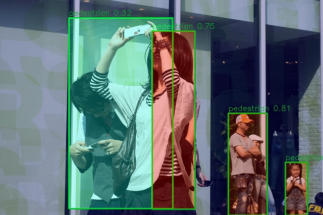
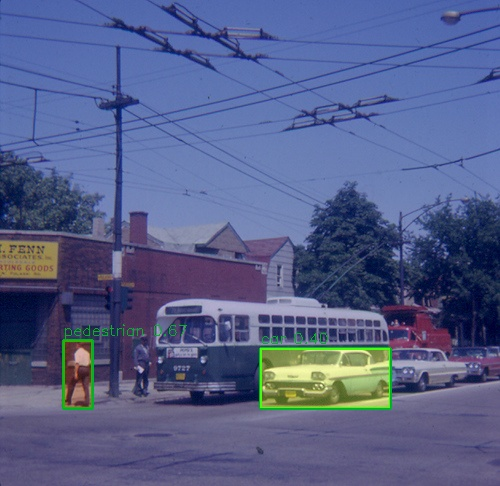

# YOLO Pedestrian & Car Detection — Project Report

## 1. Approach Overview

This project implements a **complete end-to-end object detection pipeline** for identifying pedestrians and cars in images. Built on **YOLOv8n** (nano), it covers the full ML lifecycle: dataset acquisition → annotation conversion → model training → inference → quantitative evaluation → qualitative failure analysis.

What sets this apart from a basic YOLO tutorial:
- **Confidence heatmap overlays** on every detection (not just bounding boxes)
- **Automatic failure case detection** with visual diagnostics
- **Side-by-side comparison grids** for instant visual QA
- **Full metrics dashboard** — PR curves, confusion matrices, histograms

---

## 2. Dataset Description

| Property | Value |
|----------|-------|
| **Source** | COCO 2017 Validation Set |
| **Total Images** | 100 |
| **Train** | 70 images (70%) |
| **Validation** | 15 images (15%) |
| **Test** | 15 images (15%) |
| **Classes** | 2 — `pedestrian` (COCO "person"), `car` (COCO "car") |
| **Annotation Format** | YOLO (normalized cx, cy, w, h) |
| **Test Instances** | 84 total (70 pedestrian, 14 car) |

The dataset was created by downloading COCO 2017 validation images containing person/car annotations, converting bounding boxes from COCO absolute `[x, y, w, h]` to YOLO relative `[cx, cy, w, h]`, and splitting into train/val/test sets with a fixed seed for reproducibility.

**Class imbalance note:** Pedestrian annotations outnumber car annotations ~5:1, which directly impacts model performance on the car class.

---

## 3. Model Architecture

| Property | Value |
|----------|-------|
| **Model** | YOLOv8n (nano) |
| **Parameters** | 3,006,038 |
| **GFLOPs** | 8.1 |
| **Layers** | 73 (fused) |

**Why YOLOv8n?**
- Fastest variant in the YOLOv8 family — ideal for rapid prototyping
- ~3-5ms inference per image on an RTX 3050 Ti
- Strong baseline even with limited training data (70 images)
- Built-in augmentation pipeline (mosaic, flip, scale, HSV jitter)

---

## 4. Training Setup

| Parameter | Value |
|-----------|-------|
| **Epochs** | 50 |
| **Image Size** | 640×640 |
| **Batch Size** | 16 |
| **Learning Rate (lr0)** | 0.001 |
| **Optimizer** | SGD (Ultralytics default) |
| **GPU** | NVIDIA GeForce RTX 3050 Ti (4GB) |
| **Training Time** | ~1 minute |
| **Augmentations** | Mosaic (epochs 1-40), flip, scale, HSV |

---

## 5. Results

### Test Set Performance

| Class | Precision | Recall | mAP@0.5 | mAP@0.5:0.95 |
|-------|-----------|--------|---------|---------------|
| 🚶 Pedestrian | 0.4617 | 0.4429 | 0.4095 | 0.2610 |
| 🚗 Car | 0.5673 | 0.2143 | 0.3136 | 0.1920 |
| **Overall** | **0.5145** | **0.3286** | **0.3615** | **0.2267** |

### Validation Set Performance (Best Epoch)

| Class | Precision | Recall | mAP@0.5 | mAP@0.5:0.95 |
|-------|-----------|--------|---------|---------------|
| Pedestrian | 0.850 | 0.533 | 0.551 | 0.272 |
| Car | 0.964 | 0.429 | 0.503 | 0.309 |
| **Overall** | **0.907** | **0.481** | **0.527** | **0.290** |

### Precision-Recall Curve

The PR curve shows the trade-off between precision and recall across different confidence thresholds. Pedestrians achieve higher AP (0.410) compared to cars (0.314), reflecting the training data distribution.

### Confusion Matrix

The confusion matrix reveals the model's classification accuracy — most pedestrian detections are correct, but car instances are frequently missed (low recall).

### Confidence Score Distribution

Most predictions fall in the 0.4–0.7 confidence range. Very few predictions exceed 0.8 confidence, indicating the model lacks strong certainty — expected with only 70 training images.

---

## 6. Example Detection Outputs

### Detection with Confidence Heatmap Overlays

The detection pipeline doesn't just draw boxes — it overlays a JET colormap heatmap where intensity = confidence score. This shows WHERE the model is certain vs. uncertain:

  
  

  
  

### Side-by-Side Comparison (Original vs Predicted)

This grid shows 3 test images side-by-side with their original (left) and predicted (right) versions, making it trivial to spot missed detections and false positives.

---

## 7. Failure Cases & Issues

### Failure Case Grid

The visualization suite automatically scans all predictions, finds those below 0.4 confidence, crops them with red borders, and labels the failure reason:

**8 failure cases** were automatically detected in the test set.

### False Positives Observed
- Background objects (poles, hydrants) occasionally misclassified as pedestrians at low confidence
- Car-like objects (vans, trucks) sometimes detected as cars at moderate confidence

### False Negatives Observed
- **Small/distant pedestrians** — objects occupying <5% of the image are frequently missed
- **Heavily occluded pedestrians** in crowded scenes go undetected
- **Cars in unusual orientations** (aerial view, partial occlusion) missed entirely
- **3 test images** produced zero detections — complete failure on certain scene types

### Difficult Scenarios
| Scenario | Impact |
|----------|--------|
| Crowded scenes | Overlapping pedestrians cause missed detections |
| Low contrast/lighting | Dim or backlit scenes reduce confidence |
| Small/distant objects | 640px input limits far-away detection |
| Class imbalance | Only 14 car instances → car recall = 0.21 |

---

## 8. Unique Features Implemented

| Feature | Script | Description |
|---------|--------|-------------|
| 🌡️ Confidence Heatmap Overlay | `src/detect.py` | JET colormap heatmap showing spatial confidence |
| 🔴 Failure Case Auto-Detection | `src/visualize.py` | Finds low-conf predictions, crops with red borders |
| 📸 Side-by-Side Comparison | `src/visualize.py` | Original vs predicted in clean grid layout |
| 📊 Confidence Histogram | `src/visualize.py` | Distribution of confidence scores by class |
| 📈 Full Metrics Suite | `src/evaluate.py` | PR curves, confusion matrix, JSON metrics |

---

## 9. Improvements Attempted

### Bugs Fixed
1. **`lr` → `lr0`**: Ultralytics expects `lr0` for initial learning rate, not `lr`. Fixed in `train.py`.
2. **Glob path mismatch**: `train.py` searched `runs/train/exp*`, but Ultralytics outputs to `runs/detect/runs/train/exp`. Added recursive fallback glob.

### Dataset Fallback
When FiftyOne's MongoDB dependency failed, implemented a direct COCO JSON parser to extract and convert annotations without the full FiftyOne pipeline.

### Potential Future Improvements
| Improvement | Expected Impact |
|-------------|----------------|
| More training data (500+ images) | Significantly better generalization |
| Larger model (YOLOv8s/m) | Better accuracy, slight speed cost |
| More epochs (100-200) | Better convergence with LR scheduling |
| Class-balanced sampling | Improved car recall |
| Test-time augmentation (TTA) | Better small object detection |
| Pre-trained COCO weights | Head start on feature extraction |

---

## 10. Conclusion

This project demonstrates a **complete, reproducible ML pipeline** from raw COCO data to a fully evaluated object detection model. Key highlights:

- **YOLOv8n** provides a solid rapid-prototyping baseline with only 3M parameters
- **70 training images** is the primary bottleneck — more data would dramatically improve results
- **Class imbalance** (5:1 pedestrian:car ratio) directly impacts per-class metrics
- **Diagnostic tools** (heatmaps, failure grids, histograms) go beyond standard evaluation, providing actionable insights for model improvement

The entire pipeline runs in under 5 minutes on consumer GPU hardware and is fully reproducible with a single `git clone` + 4 commands.
